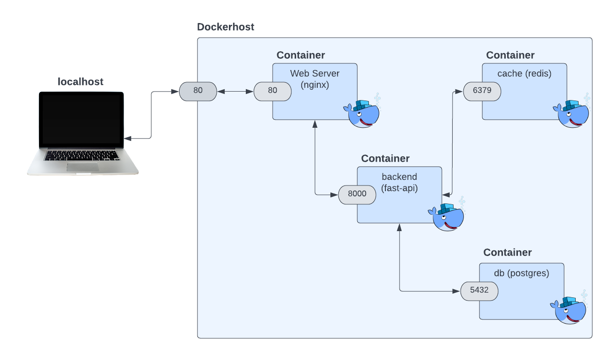

<p align="center">
    <a href="https://bitbucket.org/balabanski_v/hydraulics_web/src/4_app_web/">
        
    </a>
</p>


# hydraulics

## Architecture
[](https://bitbucket.org/balabanski_v/hydraulics_web/src/4_app_web/)

[//]: # (<p align="center">)

[//]: # (    <a href="#">)

[//]: # (        )

[//]: # (    </a>)

[//]: # (</p>)

## Технологический стек и возможности
-  [**FastAPI**](https://fastapi.tiangolo.com) для внутреннего API Python.
    -  [SQLModel](https://sqlmodel.tiangolo.com) для взаимодействия с базой данных Python SQL (ORM).
    -  [Pydantic](https://docs.pydantic.dev), используемый FastAPI для проверки данных и управления настройками.
-  [PostgreSQL](https://www.postgresql.org) в качестве базы данных SQL.
- [Docker Compose](https://www.docker.com) для разработки и производства.
- 🔑 Аутентификация токена JWT.
- расчет параметров гидропривода реализован на стороне клиента
- frontend реализован как графический интерфейс, созданный с помощью tkinter, который взаимодействует с этим API
- Пример API включает в себя:
  - [models](/backend/src/models/user.py)
  - [schemas](/backend/src/schemas/user.py)
  - [routes](/backend/src/api/v1/users.py)


## Configure

#### необходимо создать файлы конфигурации. 
- Выполните команды (это скопирует .env файлы):
```bash
cp backend/src/envs/example/.env_dev backend/src/envs
```
```bash
cp backend/src/envs/example/.env_local backend/src/envs
```
- Перед развертыванием убедитесь, что вы изменили хотя бы значения для:
`SECRET_KEY` в файле `backend/src/envs/.env_dev`

Для генерации секретных ключей вы можете запустить следующую команду:
```bash
python -c "import secrets; print(secrets.token_urlsafe(32))"
```


## Usage
после настройки .env файлов:

1. Docker: 
```Bash
make up
```
2. Посетите http://localhost:8666/api/v1/ping сервер uvicorn или http://localhost сервер nginx
3. Автоматическая интерактивная документация с пользовательским интерфейсом Swagger (из серверной части OpenAPI):
http://localhost/docs
4. Запустить приложение со стороны клиента (file main.py):
```bash
python -m main
```
## Backend local development, additional details

### Migrations
Можно создавать новые миграции и применять их с помощью:
```console
$ make alembic-revision "крутой комментарий, чувак"
$ make alembic-upgrade
```


### General workflow
См. [Makefile](/Makefile) для просмотра доступных команд.

По умолчанию зависимости управляются с помощью [Poetry](https://python-poetry.org/), зайдите туда и установите его.

Из  `./hydr_backend/` вы можете установить все зависимости с помощью:

```console
$ poetry install
```


### pre-commit hooks
Если вы еще этого не сделали, загрузите системный пакет [pre-commit](https://pre-commit.com/) и установите его. После этого установите git-хуки с помощью:
```console
$ pre-commit install
pre-commit installed at .git/hooks/pre-commit
```
